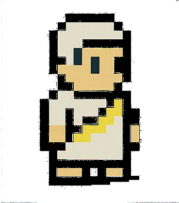

# `html/` Folder

Contains all client‑side HTML and fragment files for the Tokenized Access Gateway (TAG).

---

## Files

### 1. `gateway.html`
- **Purpose:** The main entry UI when no token is present.
- **Structure:**
  - `<head>` includes `<style><?!= include('visual') ?></style>`
  - `<body>` contains the Roman bureaucrat scene:
    - Bureaucrat sprite
    - Speech bubble prompt
    - `<form id="email-form" class="chalkboard">` for email entry
    - `<div id="response-message">` for feedback
  - At end of `<body>`:
    ```html
    <script><?!= include('accessForm') ?></script>
    ```

### 2. `accessForm.html`
- **Purpose:** Raw JavaScript logic for handling the email form in `gateway.html`.
- **Behavior:**
  1. On submit, prevents default, validates non‑empty email
  2. Disables submit button; shows “scribe” message
  3. Logs `FormSubmitted` with `google.script.run.logEvent`
  4. Calls `google.script.run.sendAccessEmail(email, gatewayURL)`
  5. On success, shows “Check your email” and re‑enables button
  6. On failure, logs `EmailError`, shows error message, re‑enables button

### 3. `visual.html`
- **Purpose:** CSS fragment for page styling and chalkboard borders.
- **Defines:**
  - `.chalkboard` border‑image from `assets`
  - `.bureaucracy-office`, `.scene`, `.bureaucrat`, `.speech-bubble`, `.response` styles

### 4. `success.html`
- **Purpose:** Displayed when a valid token is provided.
- **Structure:**
  - `<style><?!= include('visual') ?></style>`
  - Placeholder for “Access Granted” sprite:
    ```html
    
    ```

### 5. `denied.html`
- **Purpose:** Displayed when an invalid or expired token is detected.
- **Structure:**
  - `<style><?!= include('visual') ?></style>`
  - Placeholder for “Access Denied” sprite:
    ```html
    
    ```

---

## How It Works

1. **User visits** `/exec` → no `?token` → `gateway.html` is served.
2. **User enters** email → `accessForm.html` JS runs → calls `sendAccessEmail`.
3. **Email arrives** with link `...?token=XYZ`.
4. **User clicks** link → `doGet(e)` serves `success.html` or `denied.html` based on token validity.

---

## Notes

- All includes use `<?!= include('filename') ?>` to inline shared fragments.
- `gatewayURL` constant resides in `sheetConfig.gs` and should match your Web App `/exec` URL.
- Sprites and chalkboard border assets are stored under `assets/`.

---

Ready for styling tweaks or pixel‑art updates—let me know if you need to adjust classes or file names!